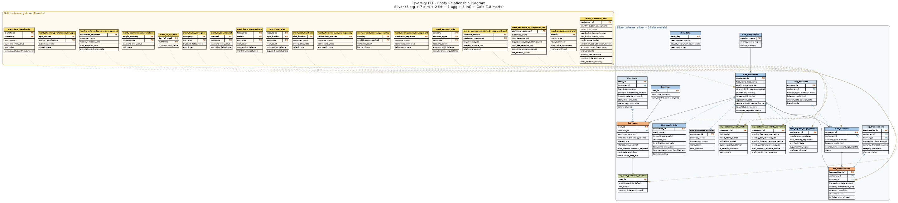

# Qversity Data 2026 — Fintech/Banking ELT Pipeline

End-to-end ELT pipeline over a synthetic LATAM fintech dataset, built with
Apache Airflow, PySpark, dbt, PostgreSQL and Power BI, fully orchestrated
inside Docker Compose. Final submission for the Qversity Data 2026 — Montevideo
program.

> Repository: `qversity-data-2026-montevideo-alexiaurrecochea`
> Author: Alexia Aurrecochea — Montevideo, Uruguay

---

## 1. Overview

Modern banks and fintechs sit on top of deeply nested, semi-structured
customer data that is awkward to query directly: every customer record bundles
demographics, multiple accounts, dozens of transactions, several loans, a
credit profile and digital engagement signals into a single JSON blob.
Business stakeholders cannot wait for engineers to flatten that JSON by hand
every time they want to know revenue by segment or delinquency by country.
This project ships the missing layer: an automated, reproducible pipeline
that turns the raw JSON into analytics-ready tables and a four-page Power BI
dashboard.

Architecturally the project implements a Bronze / Silver / Gold medallion on
PostgreSQL. Apache Airflow downloads the dataset from S3 and lands it as
JSONB in **bronze**. PySpark (running inside the Airflow container) reads
bronze via JDBC, flattens the three large arrays (`accounts`, `transactions`,
`loans`), deduplicates by natural keys, and writes staging tables into
**silver_raw**. dbt then cleans those staging tables, flattens the remaining
nested objects (`credit_info`, `digital_engagement`), builds canonical
dimensions and facts in **silver**, and finally assembles eighteen
analytics marts in **gold** that map directly to the 24 business
questions defined by the program. Power BI Desktop connects to the `gold` schema and exposes the
insights to the business.

The deliverable is evaluated on several dimensions — correct tool usage,
data modeling quality, data quality testing, end-to-end reproducibility,
and the ability to translate raw data into business insights. The repository
is therefore optimized for clarity and auditability: every non-trivial
design decision is documented in `docs/decisions.md`, every transformation
is testable with `dbt test`, and the whole pipeline is bootable with a
single `docker compose up -d --build`.

---

## 2. Author

| Field        | Value |
| ------------ | ----- |
| Name         | Alexia Arrecochea |
| Email        | alexiaurrecochea@gmail.com |
| City         | Montevideo, Uruguay |
| Cohort       | Qversity Data 2026 — Montevideo |
| GitHub       | [@aleaurre](https://github.com/aleaurre) |
| Repository   | `qversity-data-2026-montevideo-alexiaurrecochea` (private) |

**Reviewers with access** (Qversity program staff):
[@serasio](https://github.com/serasio),
[@lualopezpe](https://github.com/lualopezpe),
[@luciafrances](https://github.com/luciafrances),
[@AgusOlivera](https://github.com/AgusOlivera).

---

## 3. How to run

### 3.1 Prerequisites

| Tool                  | Minimum version | Notes |
| --------------------- | --------------- | ----- |
| Docker Engine         | 24.x            | with Compose v2 plugin (`docker compose ...`) |
| RAM available to Docker | ≥ 8 GB        | PySpark + Airflow + Postgres comfortably |
| Disk free             | ≥ 5 GB          | images, postgres data volume, dataset |
| Power BI Desktop      | latest          | Windows only; needed to open `powerbi/dashboard.pbix` |
| Outbound internet     | required        | for the S3 dataset and the JDBC driver download |

No local Python, dbt, Spark or Java installation is required: every tool
runs inside containers.

### 3.2 Clone, configure, and start

```bash
# 1. Clone
git clone https://github.com/aleaurre/qversity-data-2026-montevideo-alexiaurrecochea.git
cd qversity-data-2026-montevideo-alexiaurrecochea

# 2. Create your local .env (never commit this file)
cp env.example .env
# Edit .env if you want to change POSTGRES_PASSWORD, AIRFLOW_ADMIN_PASSWORD,
# etc. The defaults work out of the box for evaluation.

# 3. Build images and start the stack
docker compose up -d --build

# 4. Wait ~60-90 seconds for the airflow-init container to finish
#    (it creates the admin user and migrates the Airflow metastore).
#    Check progress with:
docker compose ps
docker compose logs -f airflow-init     # Ctrl-C once it says "Completed"
```

When `docker compose ps` shows `qversity_airflow_webserver` and
`qversity_airflow_scheduler` as **healthy**, the stack is ready.

### 3.3 Trigger the pipeline

1. Open Airflow at <http://localhost:8081> (mapped from container port 8080).
2. Log in with the credentials from `.env` (defaults: `admin` / `admin`).
3. Enable and trigger the DAG named **`qversity_pipeline`**.
4. A full run takes ~3–5 minutes on a laptop. The DAG has six task groups
   chained as:

   ```
   ensure_bronze_table
        ↓
   download_from_s3
        ↓
   load_to_bronze
        ↓
   flatten_accounts   flatten_transactions   flatten_loans   (in parallel)
        ↓
   dbt_run  →  dbt_test
   ```

5. When the last task (`dbt_test`) is green, the gold schema is fully built.

### 3.4 Useful dbt commands (manual debugging)

dbt is installed inside the Airflow container; you don't need it locally.

```bash
# Open a shell inside the scheduler container
docker compose exec airflow-scheduler bash

# Inside the container
cd /opt/airflow/dbt

# Build everything
dbt run   --profiles-dir /opt/airflow/dbt
dbt test  --profiles-dir /opt/airflow/dbt

# Build only the silver or gold layer
dbt run   --profiles-dir /opt/airflow/dbt --select silver
dbt run   --profiles-dir /opt/airflow/dbt --select gold

# Inspect compiled SQL — useful when debugging JSONB extractions
dbt compile --profiles-dir /opt/airflow/dbt
ls dbt/target/compiled/
```

### 3.5 Connect Power BI

Power BI must be installed on a Windows host that can reach the Postgres
container on the loopback interface.

| Setting   | Value |
| --------- | ----- |
| Server    | `localhost:5432` |
| Database  | `qversity_warehouse` |
| Schema    | `gold` |
| Auth      | Database, with the `POSTGRES_USER` / `POSTGRES_PASSWORD` from `.env` |

Open `powerbi/dashboard.pbix` and refresh once. Pre-rendered screenshots
live in `powerbi/screenshots/`.

### 3.6 Tear down

```bash
docker compose down              # stops containers, keeps the data volume
docker compose down -v           # ALSO drops the postgres volume — start fresh
```

---

## 4. Architecture

```
                 ┌─────────────────────────────────────────────┐
                 │     S3 (fintech_banking_dataset.json)       │
                 └──────────────────────┬──────────────────────┘
                                        │ HTTPS GET
                                        ▼
                 ┌─────────────────────────────────────────────┐
                 │   Apache Airflow 2.10.5  (DAG orchestrator) │
                 │   • ensure_bronze_table                     │
                 │   • download_from_s3 → load_to_bronze       │
                 │   • spark-submit  (×3, in parallel)         │
                 │   • dbt run  →  dbt test                    │
                 └──────────────────────┬──────────────────────┘
                                        │ psycopg2 (bulk insert)
                                        ▼
       ┌────────────────────────────────────────────────────────────┐
       │   PostgreSQL 15 — schema: bronze                          │
       │   raw_fintech_data (id, load_id, data jsonb, ts, source)  │
       │   • ~5,100 records / run, append-with-load_id idempotency │
       └─────────────┬─────────────────────────┬───────────────────┘
                     │ JDBC read                │ JSONB read (dbt)
                     ▼                          ▼
       ┌──────────────────────────┐   ┌───────────────────────────┐
       │  PySpark 3.5.1 (in       │   │  dbt-core 1.7+ in same    │
       │  Airflow container)      │   │  container (BashOperator) │
       │                          │   │                           │
       │  Job 1: flatten_accounts │   │  Reads silver_raw.stg_*   │
       │  Job 2: flatten_trxns    │   │  Reads bronze.raw_*       │
       │  Job 3: flatten_loans    │   │  Builds:                  │
       │                          │   │   • silver.dim_*          │
       │  • explode arrays        │   │   • silver.fct_*          │
       │  • dedup by natural PK   │   │   • silver.agg_*          │
       │  • trim + null on empty  │   │   • gold.mart_*           │
       │  • write JDBC            │   │  Runs ~225 tests          │
       └─────────────┬────────────┘   └──────────────┬────────────┘
                     │ JDBC write                    │ SQL
                     ▼                               ▼
       ┌────────────────────────────────────────────────────────────┐
       │   PostgreSQL — schemas: silver_raw, silver, gold          │
       │   silver_raw  : Spark output (staging, syntactic clean)   │
       │   silver      : dbt-built dimensions, facts, aggregates   │
       │   gold        : 8 analytics marts (one per business theme)│
       └──────────────────────────────┬─────────────────────────────┘
                                      │ ODBC / Npgsql
                                      ▼
                  ┌────────────────────────────────────┐
                  │  Power BI Desktop                  │
                  │  4-page dashboard on `gold.*`      │
                  └────────────────────────────────────┘
```

### Why each tool sits where it sits

| Layer / role | Tool | Why this tool, why not the next one up |
| ------------ | ---- | -------------------------------------- |
| Orchestration | **Airflow** | DAG semantics, retries, observable UI, and the spec requires it. Same container also hosts Spark and dbt to keep `docker compose up` as the single entry point. |
| Bronze load   | **psycopg2 + `execute_values`** | Streaming 5,100 records into JSONB; `execute_values(page_size=500)` is faster than `to_sql` and stays inside a single transaction. |
| Array flattening | **PySpark via `spark-submit`** | Per the spec. `spark-submit` keeps each script independently testable (`spark-submit spark/flatten_accounts.py` from a shell), and isolates orchestration (Airflow) from execution (Spark). |
| Semantic cleaning, modeling, tests | **dbt-core + dbt-postgres** | SQL is the right language for joins and constraints; dbt adds versioned models, lineage, generated docs, and 225+ data-quality tests. |
| Warehouse | **PostgreSQL 15** | Required by the spec; JSONB, generated columns and rich indexing handle this dataset effortlessly. |
| BI | **Power BI Desktop** | Required by the spec; connects via the native PostgreSQL connector. |
| Packaging | **Docker Compose** | A single `up -d --build` reproduces the entire pipeline on any laptop with Docker. No local Python/Java/JDBC needed. |

### Layer responsibilities (the three-level split)

| Schema       | Owner    | What it contains | What it does NOT do |
| ------------ | -------- | ---------------- | ------------------- |
| `bronze`     | Airflow  | `raw_fintech_data` — one row per customer, full JSON preserved, with `load_id` / `load_timestamp` for audit. | No transformation, no array unnesting. |
| `silver_raw` | PySpark  | `stg_accounts`, `stg_transactions`, `stg_loans` — arrays exploded, deduplicated by natural PK, syntactic cleanup (`trim()`, empty→NULL). | No casing normalization, no language mapping, no business logic. |
| `silver`    | dbt      | `dim_*` (customer, account, loan, credit_info, digital_engagement, geography, date), `fct_transactions`, `fct_loans`, `agg_customer_activity`. Casing/translation normalization, type casts, derived columns (`age`, `tenure_months`, `is_failed`), accepted-values & relationships tests. | No business definitions of revenue or delinquency, no bucketing that varies by mart. |
| `gold`      | dbt      | Eighteen `mart_*` tables, each with a documented grain, business definitions for revenue/delinquency/buckets, and a 1:1 mapping to the 24 business questions. | No raw JSON, no syntactic cleanup — everything is read from `silver`. |

The contract is: **gold only reads from silver, dbt silver only reads from
silver_raw / bronze, Spark only writes to silver_raw**. Each layer can be
rebuilt without the layer above. The full rationale lives in
`docs/decisions.md` ("División de responsabilidades por capa").

---

## 5. Data model

### 5.1 ERD



The diagram lives at `docs/diagrams/erd_silver_gold.png`; the source is at
`docs/diagrams/erd_silver_gold.mmd` (Mermaid `erDiagram` syntax) and
`scripts/build_erd.py` (Graphviz renderer, used to regenerate the PNG).

### 5.2 Entities at a glance

| Layer  | Entity | Grain | Role |
| ------ | ------ | ----- | ---- |
| silver | `stg_accounts` / `stg_transactions` / `stg_loans` | 1 row per business key | Three views on top of Spark's `silver_raw.*` output. Apply normalization macros (status, type, channel, currency casing + Spanish→English mapping), parse multi-format dates, and expose clean typed data via `ref()` to dims and facts. |
| silver | `dim_customer`            | 1 customer | Conformed dimension: identity, demographics, segment, risk, KYC, tenure, age. Built directly from `bronze.raw_fintech_data` (no array — no Spark step needed). |
| silver | `dim_account`             | 1 account  | Account descriptors and current balance. FK → `dim_customer`. |
| silver | `dim_loan`                | 1 loan     | Loan descriptors (type, term, collateral) separated from financial measures, which live in `fct_loans`. |
| silver | `dim_credit_info`         | 1 customer | Credit profile, validated credit_score & utilization with `is_*_valid` boolean flags. |
| silver | `dim_digital_engagement`  | 1 customer | App / web adoption, preferred channel. |
| silver | `dim_geography`           | 1 country  | LATAM-7 hardcoded with region label. |
| silver | `dim_date`                | 1 calendar day | Standard date dimension. |
| silver | `fct_transactions`        | 1 transaction | Transactional fact. ~89k rows. PK `transaction_id`; FKs `customer_id`, `account_id`. |
| silver | `fct_loans`               | 1 loan | Loan-state fact (snapshot). ~7.6k rows. PK `loan_id`; FK `customer_id`. |
| silver | `agg_customer_activity`   | 1 customer | Structural counts (accounts / transactions / loans / products). Lives in silver because the counts carry no business logic — they are reused by multiple marts. |
| silver (int) | `int_loan_portfolio_metrics` | 1 loan | View. Enriches `fct_loans` with `is_delinquent`, `is_default`, `dpd_bucket`, `monthly_interest_accrued`. Consumed by `mart_loan_dpd`, `mart_loan_composition`. |
| silver (int) | `int_customer_risk_profile` | 1 customer | View. Computes `risk_bucket`, `credit_score_bucket`, `utilization_bucket`, plus delinquent/default flags. Consumed by 4 risk marts. |
| silver (int) | `int_customer_monthly_revenue` | 1 customer | View. Monthly fee + interest revenue in native and USD. Consumed by `mart_customer_360` and `mart_revenue_by_segment_usd`. Created Day 10 to eliminate duplication. |

#### Gold marts (18) — grouped by analytical area

| Area | Mart | Grain | Questions answered |
| ---- | ---- | ----- | ------------------ |
| Customer | `mart_customer_360`                | 1 customer | Q1 (rollup), Q9, Q10, Q11, Q13, Q14, Q24 |
| Customer | `mart_acquisition_trend`           | 1 month | Q12 |
| Revenue  | `mart_revenue_by_segment_usd`      | 1 customer_segment | Q1 (USD snapshot) |
| Revenue  | `mart_revenue_monthly_by_segment_usd` | month × segment | Q1 (time-series, drives the Page 2 line chart) |
| Revenue  | `mart_account_mix`                 | country × account_type × currency | Q2, Q22 |
| Risk     | `mart_delinquency_by_segment`      | 1 customer_segment | Q5 |
| Risk     | `mart_credit_score_by_country`     | country × credit_score_bucket | Q6 |
| Risk     | `mart_utilization_vs_delinquency`  | 1 utilization_bucket | Q7 |
| Risk     | `mart_risk_buckets`                | 1 risk_bucket | Q9 |
| Loans    | `mart_loan_dpd`                    | loan_type × dpd_bucket × currency | Q8 |
| Loans    | `mart_loan_composition`            | loan_type × status × currency | Q4, Q23 |
| Tx       | `mart_tx_by_channel`               | channel × currency | Q3, Q17, Q18 |
| Tx       | `mart_tx_by_category`              | category × currency | Q15 |
| Tx       | `mart_tx_by_dow`                   | day_of_week × currency | Q16 |
| Tx       | `mart_international_transfers`     | origin_country × tx_currency | Q19 |
| Tx       | `mart_top_merchants`               | merchant × currency | Q22 (top-10 merchants table on Page 2) |
| Digital  | `mart_digital_adoption_by_segment` | 1 customer_segment | Q20 |
| Digital  | `mart_channel_preference_by_age`   | age_bucket × preferred_channel | Q21 |

Coverage: **24 / 24** business questions (23 ✅ + Q13 ⚠️ documented with
spec-vs-dataset divergence). The detailed mart-to-question mapping with
executable validation queries lives in
[`docs/business_questions.md`](docs/business_questions.md).

### 5.3 Main facts and dimensions — narrative

`dim_customer` is the conformed dimension that every gold mart joins to.
It is built by dbt directly from `bronze.raw_fintech_data` (its grain is
`customer_id`, no array flattening needed), with `customer_id`-level
deduplication keeping the most recent `load_timestamp` per business key.
Derived columns `age`, `age_bucket`, `tenure_months`, `tenure_bucket` and the
geo-validity flag `is_geo_valid` live here because they are *transversally*
useful, not mart-specific.

`fct_transactions` and `fct_loans` are the two transactional / state facts.
Both are materialized as Postgres tables (not views) with indexes on the join
columns (`customer_id`, `account_id`, `transaction_date`), which keeps Power
BI report queries snappy on the 89k-row transaction table. The facts only
include *syntactic* derived columns (`is_failed`, `day_of_week`,
`interest_rate_decimal`); revenue, delinquency, signed amounts and similar
business definitions are deliberately deferred to gold marts.

`agg_customer_activity` is intentionally placed in silver rather than gold.
Its grain (one row per customer) matches `dim_customer`, but unlike a true
mart it does not encode any business definition — it just counts how many
accounts / transactions / loans a customer has. Several gold marts consume
it; centralizing the counts in silver avoids repeating three LEFT JOINs +
COUNT DISTINCTs in every consumer.

Gold marts each pin one explicit grain in their model header, and their
columns are designed so the corresponding business questions become trivial
group-bys on top of the mart. The 18-mart layout deliberately splits
analytical areas into narrower marts rather than the original 8-mart design
(see `docs/decisions.md`): each mart now answers 1–3 closely related
questions at a single, clean grain. `mart_customer_360` is the one
intentional multi-purpose mart — it carries credit profile, demographics
and revenue snapshot together because the dataset is a single point in
time, so splitting them into multiple marts would just duplicate the join
in every Power BI page.

The three intermediate views (`int_loan_portfolio_metrics`,
`int_customer_risk_profile`, `int_customer_monthly_revenue`) were
introduced during Days 9–10 as the marts grew. They centralize the
business logic that more than one mart needed (delinquency flags,
risk-bucket computation, monthly revenue derivation) so the same code
isn't pasted across marts. The rule is simple: a piece of logic that
shows up in 2 or more marts moves to an `int_*` model; logic used by
exactly one mart stays as a CTE inside that mart.

---

## 6. PySpark logic

PySpark runs inside the Airflow container in `local[*]` mode — no external
cluster. Three scripts under `spark/` flatten the three nested arrays.
Each script is launched by Airflow via `spark-submit` (with the JDBC driver
pinned at `/opt/spark/jars/postgresql-42.7.3.jar`), and is also runnable
standalone for debugging.

| Script                       | What it flattens                              | Output table                   |
| ---------------------------- | --------------------------------------------- | ------------------------------ |
| `spark/flatten_accounts.py`     | `data.accounts[]` (2–5 elements / customer)   | `silver_raw.stg_accounts`      |
| `spark/flatten_transactions.py` | `data.transactions[]` (~17 / customer)        | `silver_raw.stg_transactions`  |
| `spark/flatten_loans.py`        | `data.loans[]` (0–3 / customer)               | `silver_raw.stg_loans`         |
| `spark/utils.py`                | Shared: `get_spark_session()`, `get_jdbc_config()`, `deduplicate_by_pk()`, `TARGET_SCHEMA`. | — |

### Common pattern (same for all three scripts)

1. **Read** `bronze.raw_fintech_data` via JDBC, partitioning by `id` into 4
   parallel splits (over-engineered for 5k rows but the correct pattern).
2. **Parse** the `data` column. Postgres' JDBC driver returns JSONB as a
   *string*, not as a native struct, so each script applies `from_json()`
   with an explicit `StructType` schema for *the slice of the JSON it cares
   about* (e.g. `flatten_accounts.py` only declares the customer-id + the
   accounts array fields, not credit_info or transactions).
3. **Explode** the relevant array with `explode()` (not `explode_outer()`):
   customers with zero loans are intentionally absent from `stg_loans`, so
   `loan_id` can be tested `not_null` in dbt. Cardinality preservation
   between customers and child facts is handled later as a LEFT JOIN in dbt.
4. **Promote** struct fields to top-level columns and propagate
   `customer_id`, `bronze_id`, `load_timestamp` for lineage.
5. **Syntactic cleanup**: every string column gets
   `WHEN length(trim(col)) = 0 THEN NULL ELSE trim(col)`. No casing or
   language normalization happens here — that's dbt's job.
6. **Deduplicate** with `deduplicate_by_pk(df, "<natural_id>")`. The function
   applies `ROW_NUMBER() OVER (PARTITION BY pk ORDER BY load_timestamp DESC,
   bronze_id DESC)` and keeps `rn = 1`. This means: if the same record
   appears in multiple bronze loads, the most recent load wins; ties are
   broken by `bronze_id`.
7. **Write** to `silver_raw.<table>` with `mode("overwrite")` and
   `truncate="true"`. Truncate-instead-of-drop preserves any indexes,
   permissions or constraints dbt may have created on top of the table.

### Why dedup happens in PySpark (and customer-level dedup happens in dbt)

The three arrays carry their own natural keys (`account_id`,
`transaction_id`, `loan_id`); they are the natural place to dedup the
exploded rows. Customer-level dedup (the 100 duplicated customer records
detected in EDA) is *not* an array — it's the bronze envelope — so it's
handled inside the dbt model `dim_customer` with a window function over
`customer_id ORDER BY load_timestamp DESC`. Keeping customer dedup in dbt
keeps Spark scripts focused on what only Spark does well (large-scale array
flattening) and lets the canonical customer set come out of the same place
all other customer-keyed dbt models build from.

---

## 7. Insights and Power BI dashboard

Detailed mart-to-question mapping and the full set of validated answers live
in [`docs/business_questions.md`](docs/business_questions.md). Coverage at
submission: **24 of 24** business questions answerable from gold models;
the dashboard exposes the most decision-relevant ones across four pages.

### Summary of key findings

- **Dollarization is real.** Across the LATAM portfolio, about half of all
  account balances and transaction volume are denominated in USD — heavily
  concentrated in Uruguay and Argentina. Any unit-level reporting therefore
  carries `currency` in its grain; the only mart that mixes currencies is
  `mart_revenue_by_segment_usd`, which uses a documented FX seed.
- **Revenue is a thin slice of volume.** Most of the customer's
  "transactions" are deposits/withdrawals/transfers that don't generate
  bank revenue. The defensible revenue figure (`fee_income +
  interest_income_accrued`, see §8) is roughly an order of magnitude
  smaller than transaction volume, which is the kind of distinction
  executive dashboards often blur.
- **Risk is real but bounded.** Delinquency (loans with `days_past_due > 30`
  or `status IN ('delinquent','default')`) is meaningfully elevated in
  the `retail` segment versus `premium` / `private_banking`, but the
  portfolio overall does not show extreme tail risk — the
  `mart_loan_dpd` and `mart_loan_composition` marts make the bucketing
  and the type × status mix visible at a glance.
- **Data quality is mostly synthetic, sometimes structural.** ~10% of
  `credit_score` values are out of range (probable generator bug, isolated
  into an `00 - Invalid` bucket so they don't contaminate the Poor /
  Excellent ones). The boolean-typed fields in `digital_engagement` mix
  English, Spanish and numeric variants and required a defensive cast macro.
  None of these issues are pretended-away; they are flagged with boolean
  validity columns and surfaced via dbt tests with explicit severity.

### Dashboard pages

Screenshots are stored in `powerbi/screenshots/`. Each page connects
directly to the `gold` schema; no DAX-side transformations are used beyond
display formatting and a handful of simple measures.

#### Page 1 — Executive Overview
*What it shows.* High-level KPIs (total customers, total accounts, total
AUM by currency), a country map sized by customer count, segment mix,
customer status breakdown, and a global time/country/segment slicer.
*Business questions answered.* Q10 (customers by country/city), Q13
(status breakdown), Q14 (KYC distribution), Q2 (balances by country).
*Decisions it supports.* Strategic country prioritization, segment
investment, and identifying where the active customer base lives.

#### Page 2 — Revenue & Transactions
*What it shows.* Monthly revenue trend (in USD via the FX seed), revenue
breakdown by transaction channel and category, average ticket size by
channel, and failure rate by channel.
*Business questions answered.* Q1 (revenue per customer by segment), Q3
(revenue by channel), Q15 (categories by volume/value), Q16 (day-of-week
patterns), Q17 (avg ticket by channel), Q18 (failure rate by channel).
*Decisions it supports.* Where to invest in channel reliability, which
categories drive revenue, and how channel choice maps to ticket size.

#### Page 3 — Risk & Credit
*What it shows.* Credit-score histogram with the `00 - Invalid` bucket
called out separately, scatter of credit utilization vs delinquency,
days-past-due bucketing, and a stacked bar of loan portfolio composition
by status × type.
*Business questions answered.* Q5 (delinquency by segment), Q6 (credit-score
distribution by country), Q7 (utilization vs delinquency), Q8
(days-past-due distribution), Q9 (risk-score buckets), Q23 (portfolio
composition), Q4 (interest income by loan type).
*Decisions it supports.* Risk pricing per segment, where to tighten credit
policy, and which loan types deserve closer monitoring.

#### Page 4 — Customer & Engagement
*What it shows.* Monthly acquisition trend with MoM growth, age
distribution by segment, mobile vs web adoption rate by segment, preferred
channel donut and KYC status breakdown.
*Business questions answered.* Q11 (age by segment), Q12 (acquisition
trend), Q14 (KYC), Q20 (mobile adoption by segment), Q21 (digital vs
branch by age).
*Decisions it supports.* Where to focus acquisition spend, which segments
to nudge toward digital channels, and which KYC pipeline stages need
remediation.

---

## 8. Assumptions and design decisions

Every non-trivial choice is documented in `docs/decisions.md` (chronological
day-by-day). What follows is the curated subset that an evaluator needs to
read the marts correctly.

### 8.1 Data quality assumptions

| Field                             | Treatment | Why |
| --------------------------------- | --------- | --- |
| Categorical casing + Spanish translations across all string fields (`status`, `customer_segment`, `kyc_status`, `transaction_type`, etc.) | Normalize in dbt via per-field `normalize_*` macros (`lower(trim(...))` + explicit Spanish→English mapping); enforce canonical set with `accepted_values` tests. | Casing chaos is a generator-wide pattern; tests catch any new variant. |
| `customer.status` values are `{active, frozen, closed}` whereas the spec lists `{active, inactive, suspended, closed}` | Use the observed set; explicit divergence note in `decisions.md`. | The data is the source of truth; silently conforming would hide the discrepancy. |
| ~6.8% of customers have invalid lat/lon (out of [-90,90] / [-180,180]) | Keep the customer row; null `lat`/`lon`; expose `is_geo_valid = false`. | No row loss; the issue is queryable instead of swept under the rug. |
| `nationality == country` in 100% of records | Keep the column; add `expression_is_true` test asserting equality. | If the test ever fails, that's a real signal worth a re-look. |
| City names contain typos (`Lma` → Lima, etc.) | Deferred. Aggregations use `country`, not `city`. | Fixing free-text would require a hand-curated mapping; not worth it for marts that aggregate by country. |
| ~10% of `credit_score` values out of FICO range | Keep raw value; add `is_credit_score_valid` boolean; route invalid values to bucket `00 - Invalid` in `mart_customer_360`. | Don't pretend bad data isn't there; let it be filterable. |
| ~3% NULL on `transactions.amount`, ~2.8% on `accounts.balance` | dbt test severity `warn`, not `error`. | Real generator data quality; documenting it is more honest than blocking the build. |
| Boolean columns in `digital_engagement` mix `true/false`, `yes/no`, `si/sí`, `1/0` | Defensive macro `safe_cast_boolean()` that maps each accepted variant explicitly and routes anything else to NULL. | Materializing `dim_digital_engagement` as a table surfaced these bugs; the macro stops them at write-time. |
| `collateral_type = "None"` literal string for ~48% of loans | Mapped to `unsecured` in gold; `"None"` → real NULL in silver. | Preserves the semantic ("no collateral") while keeping the field usable. |

### 8.2 Business definitions (frozen on Day 9)

These are the definitions every gold mart respects.

**Revenue.** `revenue = fee_income + interest_income_accrued`.
- `fee_income = SUM(transactions.amount)` where `transaction_type = 'fee'`
  AND `status = 'completed'`. Failed/reversed/pending fees do *not* count.
- `interest_income_accrued (monthly) = SUM(outstanding_balance * interest_rate / 12)`
  for loans whose `status IN ('current', 'delinquent')`. Paid-off and
  defaulted loans do not accrue.

**Delinquency.** A loan is delinquent if `days_past_due > 30` **OR**
`status IN ('delinquent', 'default')`. Delinquency rate excludes
`paid_off` loans from the denominator.

**Tenure.** `tenure_years = (today − registration_date) / 365.25`.

**Currency strategy.** Sixteen marts operate in local currency and
carry `currency` in their grain (no FX magic). Two marts —
`mart_revenue_by_segment_usd` (snapshot by segment) and
`mart_revenue_monthly_by_segment_usd` (time series, drives the Page 2
line chart) — convert to USD via the `seeds/fx_rates.csv` snapshot and
the `to_usd()` macro. EDA shows ~50% of activity is already
USD-denominated regardless — this is a real LATAM dollarization signal,
not a data quality issue. The FX seed covers 9 currencies (USD, ARS,
BRL, CLP, COP, MXN, PEN, UYU, EUR); EUR was added after a
`relationships` test flagged ~1% of transactions denominated in EUR
that were not initially in the seed.

### 8.3 Bucketing definitions

| Bucket family | Buckets | Lives in |
| ------------- | ------- | -------- |
| **Age** (from `date_of_birth`) | `01 - 18-24`, `02 - 25-34`, `03 - 35-44`, `04 - 45-54`, `05 - 55-64`, `06 - 65+`, `99 - Unknown` | Silver (`dim_customer.age_bucket`) |
| **Tenure** (from `registration_date`) | `new` (<6mo), `established` (6-24mo), `loyal` (>24mo), `unknown` (NULL) | Silver |
| **Risk score** (0-100) | `low` (0-30), `medium` (30-60), `high` (60-85), `critical` (85-100) | Gold (per-mart macro) |
| **Credit score** (FICO + invalid) | `00 - Invalid (out of range)`, `01 - Poor (300-579)`, `02 - Fair (580-669)`, `03 - Good (670-739)`, `04 - Very Good (740-799)`, `05 - Excellent (800-850)`, `99 - Unknown` | Gold |
| **Credit utilization** (0-100) | `low` (<30), `medium` (30-70), `high` (70-90), `critical` (>90) | Gold |
| **Days past due** | `current` (0), `1-30`, `31-60`, `61-90`, `90+` | Gold |

The placement rule of thumb: if 3+ marts use it, it lives in silver and
becomes a stable column; if 1-2 marts use it or the definition is likely
to change, it stays in gold as a macro. Risk and credit buckets are
intentionally close to the business definition, so they can be tweaked
without disturbing silver.

### 8.4 Design trade-offs

- **PySpark in `local[*]`, not a real cluster.** Justified by the 5k-record
  dataset. Trade-off: this configuration would not scale to millions of
  rows; production would need a Spark cluster. Documented in
  `decisions.md` so it's an explicit, not a hidden, limitation.
- **dbt installed inside the Airflow image, not a separate service.**
  dbt has no daemon — it's a CLI invoked on demand — so a separate
  container would add weight with no payoff. The trade-off is that the
  Airflow image is larger; that's acceptable for a project meant to be
  `docker compose up`-able in one shot.
- **dbt model materialization.** `stg_*` are views (cheap rebuilds);
  `dim_*`, `fct_*`, `agg_*`, `mart_*` are tables (Power BI performance,
  and eager type-cast at write-time exposes bugs that views would hide).
- **Append-with-`load_id` in bronze, overwrite-with-truncate in silver_raw.**
  Bronze is an audit log: every run gets a fresh `load_id`, no record is
  ever silently overwritten. Silver_raw, by contrast, is staging — it
  always reflects the *current* bronze state via the dedup window, so
  rewriting it is correct semantics.
- **A few `agg_customer_activity`-style helpers in silver.** A purist
  three-layer reading might object to any aggregate below gold. The
  pragmatic counter-argument (documented in `decisions.md`) is that
  *structural* counts (how many accounts does a customer own?) are
  business-definition-free and reused by multiple marts; keeping them in
  silver removes triple-join repetition in gold without smuggling
  business logic upstream.

---

## License

MIT — see [`LICENSE`](LICENSE).

## Acknowledgements

To the Qversity Data 2026 team for the program structure and the dataset.
Built in Montevideo, Uruguay.
