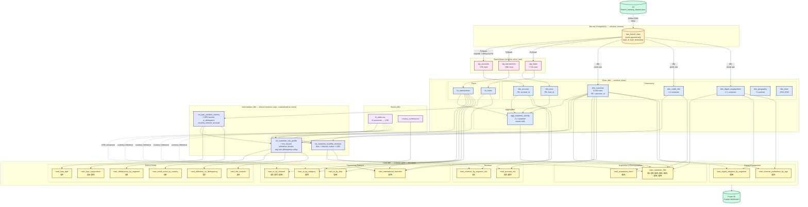

```mermaid
flowchart TB
    %% =========================================================================
    %% Qversity ELT pipeline — full lineage
    %% =========================================================================
    %% Bronze ─→ Silver (via Spark for arrays, dbt for flat / nested objects)
    %%        ─→ Intermediate (dbt — shared business logic)
    %%        ─→ Gold (dbt — analytics marts per business question)
    %%        ─→ Power BI
    %% =========================================================================

    %% ----- SOURCE -----
    S3[("S3<br/>fintech_banking_dataset.json")]

    %% ----- BRONZE -----
    subgraph BRONZE["Bronze (PostgreSQL — schema: bronze)"]
        RAW[("raw_fintech_data<br/><i>jsonb append-only<br/>load_id, load_timestamp</i>")]
    end

    %% ----- SILVER_RAW (Spark outputs) -----
    subgraph SPARK["Spark flatten (schema: silver_raw)"]
        STG_ACC["stg_accounts<br/><i>~17k rows</i>"]
        STG_TX["stg_transactions<br/><i>~89k rows</i>"]
        STG_LOANS["stg_loans<br/><i>~7.6k rows</i>"]
    end

    %% ----- SILVER (dbt models) -----
    subgraph SILVER["Silver (dbt — schema: silver)"]
        direction TB

        subgraph SILVER_DIM["Dimensions"]
            DIM_CUST["dim_customer<br/><i>5,000 rows<br/>PK: customer_id</i>"]
            DIM_ACC["dim_account<br/><i>PK: account_id</i>"]
            DIM_LOAN["dim_loan<br/><i>PK: loan_id</i>"]
            DIM_CRED["dim_credit_info<br/><i>1:1 customer</i>"]
            DIM_DIG["dim_digital_engagement<br/><i>1:1 customer</i>"]
            DIM_GEO["dim_geography<br/><i>7 countries</i>"]
            DIM_DATE["dim_date<br/><i>2015-2030</i>"]
        end

        subgraph SILVER_FCT["Facts"]
            FCT_TX["fct_transactions"]
            FCT_LOANS["fct_loans"]
        end

        subgraph SILVER_AGG["Aggregates"]
            AGG_CUST["agg_customer_activity<br/><i>1:1 customer<br/>counts only</i>"]
        end
    end

    %% ----- SEEDS -----
    subgraph SEEDS["Seeds (dbt)"]
        FX["fx_rates.csv<br/><i>9 currencies → USD</i>"]
        CC["country_currency.csv"]
    end

    %% ----- INTERMEDIATE -----
    subgraph INTERMEDIATE["Intermediate (dbt — shared business logic, materialized as views)"]
        INT_LOAN["int_loan_portfolio_metrics<br/><i>+ DPD bucket, is_delinquent,<br/>monthly_interest_accrued</i>"]
        INT_RISK["int_customer_risk_profile<br/><i>+ risk_bucket, utilization_bucket,<br/>any-rule delinquency rollup</i>"]
        INT_REV["int_customer_monthly_revenue<br/><i>fees + interest, native + USD</i>"]
    end

    %% ----- GOLD MARTS -----
    subgraph GOLD["Gold (dbt — schema: gold — 16 marts)"]
        direction TB

        subgraph GOLD_ACQ["Acquisition & Demographics"]
            M_ACQ["mart_acquisition_trend<br/><b>Q12</b>"]
            M_360["mart_customer_360<br/><b>Q1, Q9, Q10, Q11, Q13, Q14, Q24</b>"]
        end

        subgraph GOLD_REV["Revenue"]
            M_REV["mart_revenue_by_segment_usd<br/><b>Q1</b>"]
            M_MIX["mart_account_mix<br/><b>Q2, Q22</b>"]
        end

        subgraph GOLD_RISK["Risk & Credit"]
            M_DEL["mart_delinquency_by_segment<br/><b>Q5</b>"]
            M_CS["mart_credit_score_by_country<br/><b>Q6</b>"]
            M_UTIL["mart_utilization_vs_delinquency<br/><b>Q7</b>"]
            M_RISK["mart_risk_buckets<br/><b>Q9</b>"]
            M_DPD["mart_loan_dpd<br/><b>Q8</b>"]
            M_LOAN["mart_loan_composition<br/><b>Q4, Q23</b>"]
        end

        subgraph GOLD_TX["Transaction Patterns"]
            M_CHAN["mart_tx_by_channel<br/><b>Q3, Q17, Q18</b>"]
            M_CAT["mart_tx_by_category<br/><b>Q15</b>"]
            M_DOW["mart_tx_by_dow<br/><b>Q16</b>"]
            M_INTL["mart_international_transfers<br/><b>Q19</b>"]
        end

        subgraph GOLD_DIG["Digital Engagement"]
            M_DIG["mart_digital_adoption_by_segment<br/><b>Q20</b>"]
            M_CHAGE["mart_channel_preference_by_age<br/><b>Q21</b>"]
        end
    end

    %% ----- POWER BI -----
    PBI[("Power BI<br/><i>4-page dashboard</i>")]

    %% =========================================================================
    %% Edges — pipeline flow
    %% =========================================================================

    %% S3 → Bronze (Airflow DAG)
    S3 -->|Airflow DAG<br/>daily| RAW

    %% Bronze → Silver_raw (Spark flatten + dedup)
    RAW -->|"PySpark<br/>explode + dedup by PK"| STG_ACC
    RAW -->|"PySpark"| STG_TX
    RAW -->|"PySpark"| STG_LOANS

    %% Bronze → Silver dim_customer / dim_credit / dim_digital (dbt jsonb)
    RAW -->|"dbt<br/>jsonb ops"| DIM_CUST
    RAW -->|"dbt<br/>jsonb ops"| DIM_CRED
    RAW -->|"dbt<br/>jsonb ops"| DIM_DIG

    %% Silver_raw → Silver dim/fct (dbt cleaning + dim derivation)
    STG_ACC --> DIM_ACC
    STG_TX --> FCT_TX
    STG_LOANS --> DIM_LOAN
    STG_LOANS --> FCT_LOANS

    %% Silver internal: agg_customer_activity rolls up dim_customer + dim_account + dim_loan + fct_transactions
    DIM_CUST --> AGG_CUST
    DIM_ACC --> AGG_CUST
    DIM_LOAN --> AGG_CUST
    FCT_TX --> AGG_CUST

    %% Silver → Intermediate
    FCT_LOANS --> INT_LOAN
    DIM_CUST --> INT_RISK
    DIM_CRED --> INT_RISK
    INT_LOAN --> INT_RISK
    FCT_TX --> INT_REV
    FCT_LOANS --> INT_REV
    DIM_CUST --> INT_REV
    FX --> INT_REV

    %% Intermediate → Gold (marts that consume intermediates)
    INT_LOAN --> M_DPD
    INT_LOAN --> M_LOAN
    INT_RISK --> M_DEL
    INT_RISK --> M_CS
    INT_RISK --> M_UTIL
    INT_RISK --> M_RISK
    INT_REV --> M_360
    INT_REV --> M_REV

    %% Silver → Gold (marts that read directly from silver)
    DIM_CUST --> M_ACQ
    DIM_CUST --> M_360
    DIM_CRED --> M_360
    DIM_DIG --> M_360
    AGG_CUST --> M_360
    DIM_ACC --> M_MIX
    DIM_CUST --> M_MIX
    FCT_TX --> M_CHAN
    FCT_TX --> M_CAT
    FCT_TX --> M_DOW
    FCT_TX --> M_INTL
    DIM_ACC --> M_INTL
    DIM_CUST --> M_INTL
    CC --> M_INTL
    DIM_CUST --> M_DIG
    DIM_DIG --> M_DIG
    DIM_CUST --> M_CHAGE
    DIM_DIG --> M_CHAGE

    %% Seeds support Gold marts that need currency conversion
    FX -.->|"USD conversion"| M_REV
    FX -.->|"currency reference"| M_CHAN
    FX -.->|"currency reference"| M_CAT
    FX -.->|"currency reference"| M_DOW
    FX -.->|"currency reference"| M_INTL

    %% Gold → Power BI
    GOLD --> PBI

    %% Styling
    classDef bronze fill:#fef3c7,stroke:#92400e,stroke-width:2px
    classDef spark fill:#fce7f3,stroke:#9d174d,stroke-width:2px
    classDef silver fill:#dbeafe,stroke:#1e40af,stroke-width:2px
    classDef intermediate fill:#e0e7ff,stroke:#3730a3,stroke-width:2px
    classDef gold fill:#fef9c3,stroke:#854d0e,stroke-width:2px
    classDef seed fill:#f3e8ff,stroke:#6b21a8,stroke-width:2px
    classDef external fill:#d1fae5,stroke:#065f46,stroke-width:2px

    class S3 external
    class RAW bronze
    class STG_ACC,STG_TX,STG_LOANS spark
    class DIM_CUST,DIM_ACC,DIM_LOAN,DIM_CRED,DIM_DIG,DIM_GEO,DIM_DATE,FCT_TX,FCT_LOANS,AGG_CUST silver
    class INT_LOAN,INT_RISK,INT_REV intermediate
    class M_ACQ,M_360,M_REV,M_MIX,M_DEL,M_CS,M_UTIL,M_RISK,M_DPD,M_LOAN,M_CHAN,M_CAT,M_DOW,M_INTL,M_DIG,M_CHAGE gold
    class FX,CC seed
    class PBI external
```
